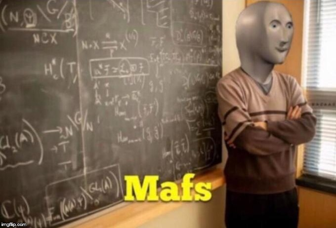

# C++ "Mafs" library

This is a C++ library that I'm writing to improve my programming, math and problem solving skills.

If you want a real library checkout [Eigen](eigen.tuxfamily.org/).

## Content

### Matrix classes and operations

This is a `C++ dynamic matrix class` aiming to have high performance using AVX2 extensions, cuda and openmp.

[Matrix.cc](./Matrix.cc): the base matrix class, it have all the basic features, such as row/col insertion, remove, swap, reshape, etc. Also the basic operators (+, -, *, ==, =, so on). This file doesn't have any kind of dependency, it only uses the std C++11 library.

[basic_op.cc](./basic_op.cc): implements all the operations such as: LU decomposition of a NxN matrix, multiplication, determinant using LU decomposition. This class have the basic algorithms. This file doesn't have any kind of dependency, it only uses the std C++11 library.

[cuda_op.cc](./cuda_op.cc): W.I.P.

[avx_op.cc](./avx_op.cc): W.I.P.

[openmp_op.cc](./openmp_op.cc): W.I.P.

#### Usage

If you only want the Matrix class just import the `Matrix.cc` file, and if you want the Operations you'll need to import the `Operations.cc` file and keep the Matrix file in the same folder.

## Documentation

I promise to make a proper Wiki.

## License

It is under the MIT License, check [LICENSE](./LICENSE) file for more information.
